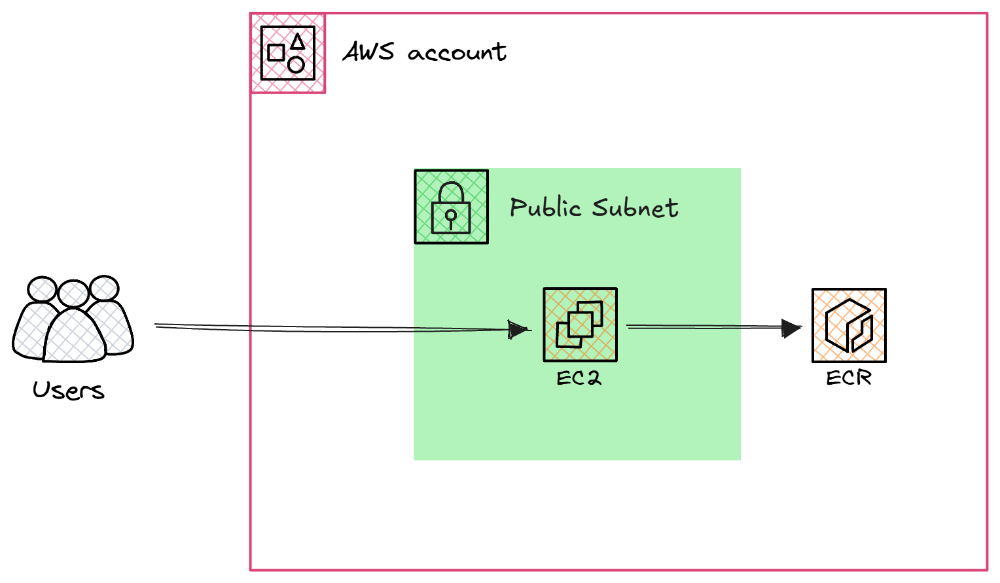
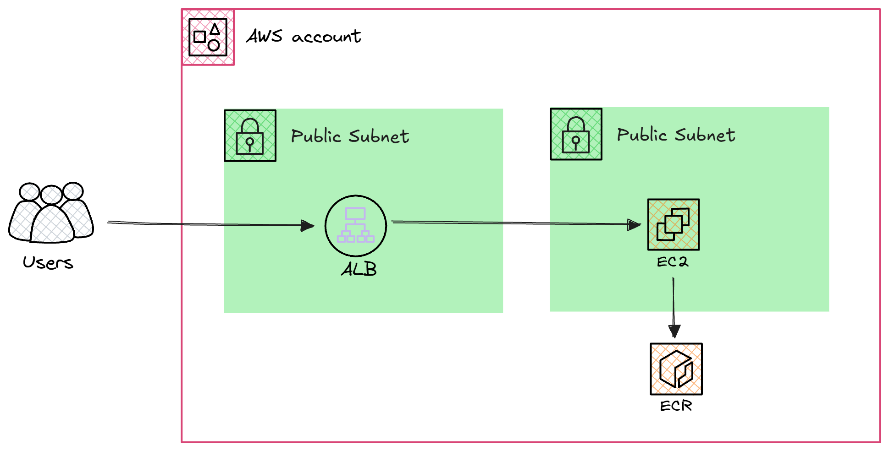
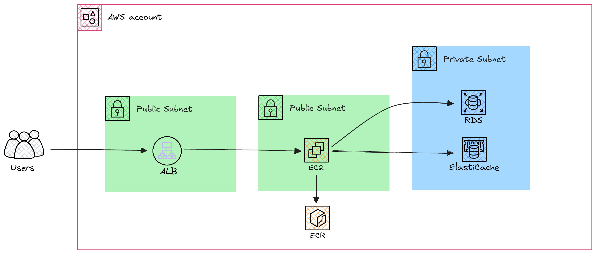

# Project Concept

This project focuses on developing a scalable online platform for a bookstore. The application integrates a reliable backend and a dynamic frontend. The backend manages user authentication, book inventory, and order processing, while the frontend provides a seamless and engaging user experience for browsing and purchasing books. Additionally, caching mechanisms are employed to enhance performance, ensuring a robust and efficient user experience.

# Project Overview

This project is structured into three primary components: backend services (RDS and Redis), and the frontend. Each component plays a critical role in delivering a comprehensive solution. Below is a summary of the key elements:

- **Backend (RDS)**: Built with a focus on scalability and reliability, managing relational database operations.
- **Backend (Redis)**: Optimized for session caching and quick access to frequently used data.
- **Frontend**: Designed to provide a dynamic and interactive user interface.

The platform utilizes PostgreSQL for database management and Redis for caching, ensuring optimal performance.


## File Structure

### 1. **Backend (RDS)**
- **Purpose**: Manages application logic and integrates with a relational database service.
- **Files**:
  - `manage.py`: Entry point for the backend application.
  - `requirements.txt`: Lists dependencies for the project.
  - `backend_rds/`: Contains the core backend logic, configuration files, and routes for the application.

### 2. **Backend (Redis)**
- **Purpose**: Handles backend logic with Redis for caching.
- **Files**:
  - `manage.py`: Entry point for the backend application.
  - `requirements.txt`: Lists dependencies for the project.
  - `backend_redis/`: Contains the core backend logic, configuration files, and routes for the application.

### 3. **Frontend**
- **Purpose**: Provides the user interface.
- **Files**:
  - `manage.py`: Entry point for the frontend application.
  - `requirements.txt`: Lists frontend dependencies.
  - `frontend/`: Contains configuration files, routing, views, and templates for the frontend interface.


## Lifehacks

**Use ChatGPT everywhere**

**But don't ask it to write the code or solutions for you.**

Initially, use it to understand the diagram, all the interconnections on it, and why everything is arranged this way.

Next, use it when taking courses to find the information you need for the project's implementation. Use it here to deepen your understanding, create more examples and analogies. Break concepts into the simplest levels of abstraction and show maximum creativity when working with it.

Refer back to the course we took initially (about ChatGPT), recall the methods and strategies of prompts, and use them.
Your main task is not just to implement the project but to learn how to break down new information into the simplest pieces with ChatGPT and build understanding as quickly as possible.

## Deployment Flow

### Local Testing
- Follow the steps in **Local Testing** to set up and validate the application locally using Docker Compose.

### Step 1: Deploying the Basic Architecture
- Deploy the backend services on EC2 instances in a public subnet as described in **Step 1: Deploying the Basic Architecture**.

### Step 2: Introducing Load Balancing
- Set up an Application Load Balancer (ALB) as outlined in **Step 2: Introducing Load Balancing** to distribute traffic across multiple backend instances.

### Step 3: Incorporating Databases and Caching
- Implement secure database and caching services using RDS and ElastiCache in a private subnet as described in **Step 3: Incorporating Databases and Caching**.

### CI/CD Process

- Implement separate CI/CD pipelines for backend and frontend deployment to automate the process effectively.

## Local Testing

### Step 1: Cloning the Repository
Clone the repository to your local machine and navigate to the project directory:
```bash
git clone https://github.com/THE-GAME-DEVOPS/bookstore.git
cd bookstore
```

### Step 2: Writing Dockerfiles for Services
Write a `Dockerfile` for each service, including:
- Backend RDS
- Backend Redis
- Frontend

Ensure each `Dockerfile` is properly configured to build and run its respective service.

### Step 3: Creating `docker-compose.yml` and Environment Variables
Write a `docker-compose.yml` file to define all the services, including Redis, PostgreSQL, and backend services. Include the following:
- **Redis**: Use the official Redis image ([Redis Docker Hub](https://hub.docker.com/_/redis)).
- **PostgreSQL**: Use the official PostgreSQL image ([PostgreSQL Docker Hub](https://hub.docker.com/_/postgres)).
- **backend-rds**: This service should depend on PostgreSQL.
- **backend-redis**: This service should depend on Redis.
- **Frontend**: Use the frontend Dockerfile built.

***Make sure to place the corresponding `Dockerfile` for each backend service in the correct directory.***

### Step 4: Building and Running Services
Build and start all services using Docker Compose with the `--build` option to rebuild images:
```bash
docker-compose up -d --build
```

### Step 5: Monitoring Logs
To troubleshoot issues and monitor logs for each service:
- View logs for all services:
  ```bash
  docker-compose logs -f
  ```
- View logs for a specific service (e.g., backend-rds):
  ```bash
  docker-compose logs -f backend-rds
  ```
- Stop monitoring logs by pressing `Ctrl+C`.

### Step 6: Testing the Frontend
After starting all services, verify that the frontend served by Nginx is accessible.

### Step 7: Stopping Services
To stop all running services:
```bash
docker-compose down
```

## AWS Deployment

### Step 1: Deploying the Basic Architecture



In the first step, deploy the application with a simple setup:

- Launch an EC2 instance in a **public subnet** for hosting the application backend.
- Use **Amazon ECR** for managing container images.
- Upload the docker-compose.yml file to the EC2 instance to define services and pull images from ECR


### Step 2: Introducing Load Balancing



In the second step, enhance scalability and availability:


- Add an **Application Load Balancer (ALB)** in the **public subnet** to distribute traffic.


### Step 3: Incorporating Databases and Caching



In the final step, integrate data storage and caching:

- Deploy **RDS** and **ElastiCache (Redis)** in a **private subnet** for secure database and caching operations.

## CI/CD Process

Setting up a CI/CD pipeline is essential for automating the build, test, and deployment processes. You can choose to use either **GitHub Actions** or **GitLab CI/CD** based on your preference. Here are the general steps:

1. **Pipeline Configuration**:

   - Define a pipeline in GitHub Actions or in GitLab CI/CD.
   - Include stages for building Docker images, running tests, and deploying to AWS.

2. **Docker Integration**:

   - Configure the pipeline to build and push Docker images to Amazon ECR.

3. **Environment Variables**:

   - Store sensitive data, such as AWS credentials, database connection strings, and API keys, securely within the CI/CD platform.

4. **Testing**:

   - Add automated tests to validate the backend and frontend components.

5. **Deployment**:

   - Deploy the backend and frontend to AWS EC2 instances as defined in the pipeline.